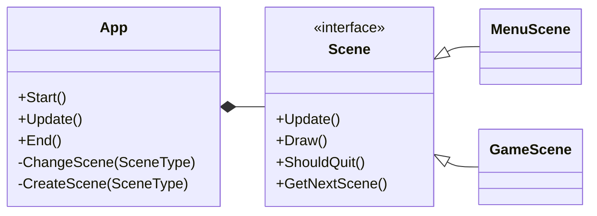
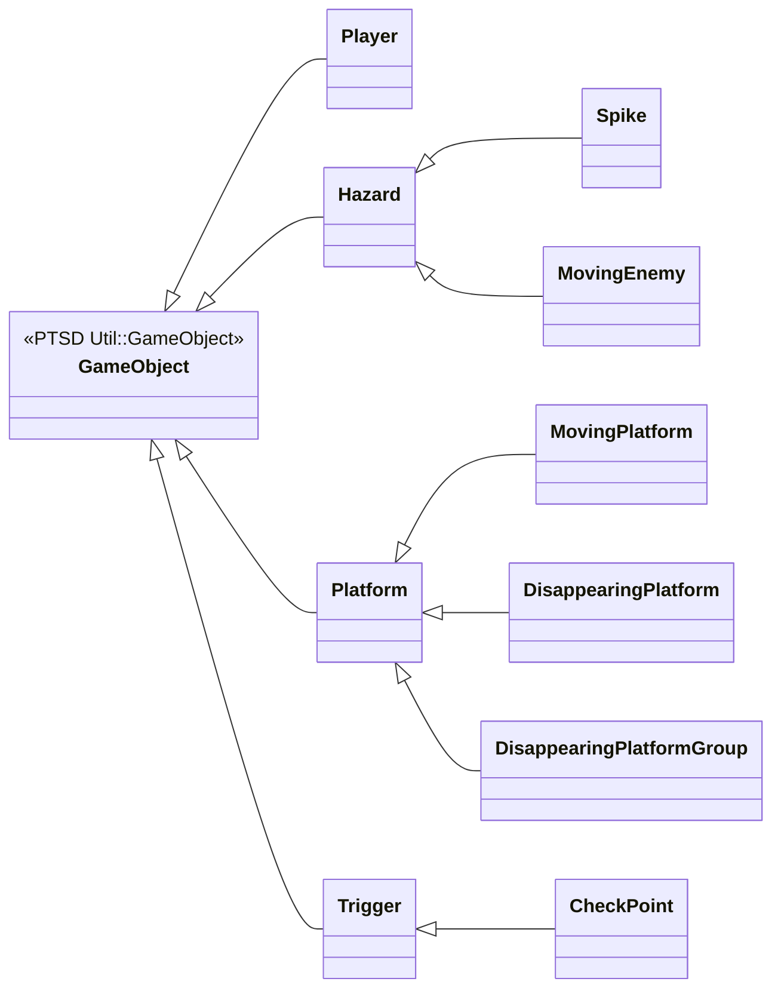
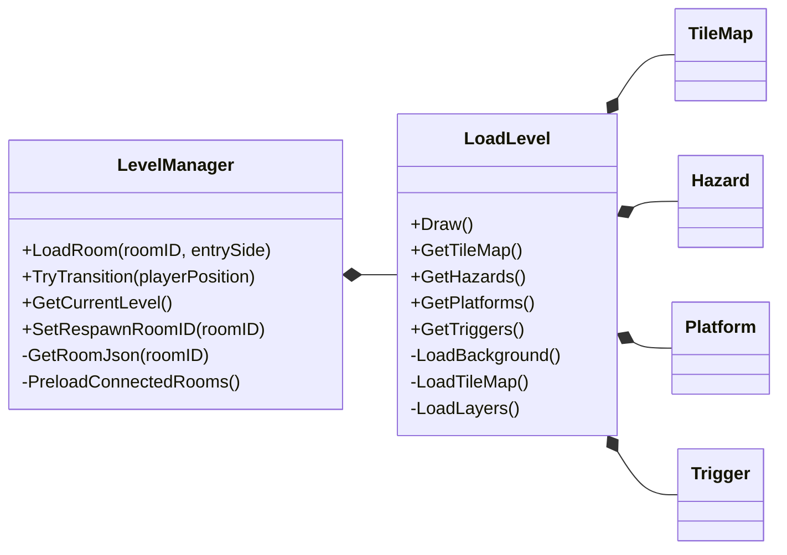
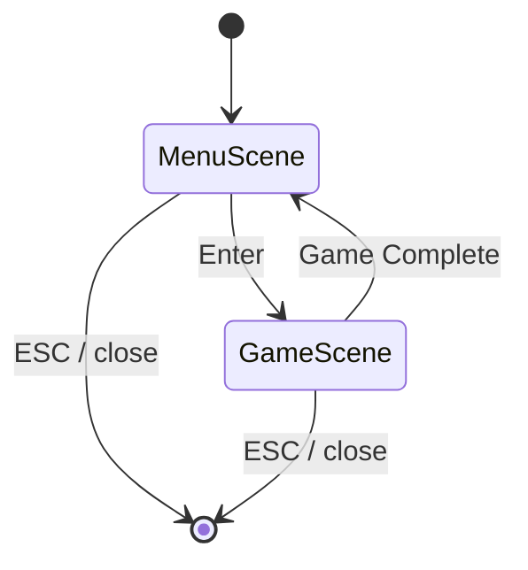

# 2026 OOPL Final Report

## 組別資訊

組別：T46
組員：吳恩彤 陳彥岑
復刻遊戲：VVVVVV Demo

## 專案簡介
遊戲介紹：https://youtu.be/ZoTDuCty7jQ

### 遊戲簡介
VVVVVV Demo 是經典 2D 復古平台益智遊戲的免費體驗版。玩家扮演船長 Viridian，無法跳躍，只能透過「翻轉重力」來操控角色在天花板與地面間穿梭，挑戰快速、高難度且極簡的關卡設計。
### 組別分工
| 11382014 吳恩彤 | 113820031 陳彥岑 |
|----------------|-----------------|
| 關卡資料結構 | 設計角色移動邏輯 |
| 實作關卡暫存點 | 實作碰撞偵測 |
| 設計敵人移動邏輯 | 實作角色死亡判定 |
| 音效 & 遊戲封面 | |
## 遊戲介紹

本專題以經典 2D 平台益智遊戲 VVVVVV 為參考，實作其 Demo 版本，重現遊戲中獨特的「重力翻轉」玩法。玩家將扮演太空船船長 Viridian，在無法傳統跳躍的限制下，透過改變自身的重力方向，在地板與天花板之間移動，躲避尖刺、移動敵人等障礙，並利用各種平台機制突破關卡，最終抵達終點。

本專案採用物件導向程式設計方式進行開發，將遊戲中的角色、障礙物、平台、地圖以及觸發事件等元素抽象化為不同類別。透過繼承與組合的設計，讓各個遊戲物件能夠共用基本功能，同時保有各自的特殊行為，提高程式的可讀性、擴充性與維護性。

### 遊戲規則

#### 角色移動
- ```LEFT```、```RIGHT``` : 可控制玩家左右移動
- ```UP```、```DOWN```、```SPACE``` : 可控制玩家重立方向
    - 當玩家切換重力時，角色的重力方向會立即反轉。
    - 玩家必須掌握翻轉時機，利用地形設計避開障礙或到達無法直接行走的區域。
    - 在尚未接觸到地面或天花板時無法實現重力翻轉
#### 角色動畫
靠著不同狀態的照片循環播放 呈現出動畫的效果
|                    角色狀態照片 1                    |                    角色狀態照片 2                    |                    角色狀態照片 3                    |
|:----------------------------------------------------:|:----------------------------------------------------:|:----------------------------------------------------:|
|  |  |  |
#### 角色方向轉變

|      |                       重立向下                       |                       重立向上                       |
| ---- |:----------------------------------------------------:|:----------------------------------------------------:|
| 朝左 |  |  |
| 朝右 |  |  |

#### 障礙物與死亡判定
關卡中存在 ```Hazaed``` 分別為 ```Spike``` 以及 ```Moving Enemy``` 碰到即觸發死亡
|         | 圖片1                                                  | 圖片2                                                    | 圖片3                                                 | 圖片4                                                 |
| ------- | ------------------------------------------------------ | -------------------------------------------------------- | ----------------------------------------------------- | ----------------------------------------------------- |
| Hazard1 |  |  | X                                                     | X                                                     |
| Hazard2 |   |     |  |  |
| Hazard3 |   |  |  |  |
| Hazard4 | ||||
| Hazard5 | ||||
| Hazard6 | ||X|X|
| Hazard7 |||X|X|
| Hazard8 |||||
| Hazard9 |||||

當角色碰觸危險物件時，角色死亡，並重新回到最近的 ```Checkpoint```

#### 平台與特殊機制
遊戲包含一般平台、移動平台以及消失平台等不同類型的平台。
不同的平台具有不同的移動或顯示規則，增加關卡挑戰性。
| 名稱 | Moving Platform | Disappearing Platform |
| ---- | --------------- | --------------------- |
| 圖片 ||      |
| 功能 |   會依照關卡設定進行左右或上下移動，當玩家採到平台上時會隨著平台一起移動| 平台本身不會移動，但當玩家碰到平台時會開始消失    |

#### 關卡設定
每個房間即為一個關卡
每個關卡內包含 Hazard、Platform
玩家需要依靠地形、平台走到下一個房間(關卡)
### 遊戲畫面

|          |                                     圖片                                     |
| -------- |:----------------------------------------------------------------------------:|
| 遊戲封面 |  |
| 遊玩畫面 |                           |


## 程式設計


### 程式架構
#### 1. 場景與 App 架構

`App` 只負責目前狀態與場景切換；真正的畫面邏輯交給 `MenuScene` 與 `GameScene`。這樣可以避免所有流程都堆在主迴圈中，也讓後續新增場景時只需要增加新的 `Scene` 子類。

#### 2. 遊戲物件繼承架構圖

`Hazard`、`Platform`、`Trigger` 都提供虛擬介面，讓 `GameScene` 能以多型方式更新與判斷物件，不必在遊戲流程中寫大量型別分支。

#### 3. 關卡載入與房間管理

`LevelManager` 負責目前房間、相鄰房間、房間切換與 JSON 快取；`LoadLevel` 專注把單一房間 JSON 轉成背景、TileMap、危險物件、平台與觸發器。

#### 4. 遊戲狀態轉移圖


### 程式技術
本專案主要使用物件導向程式設計的核心概念，包括封裝（Encapsulation）、繼承（Inheritance）與多型（Polymorphism），來建立遊戲架構。

#### 1. 類別繼承與多型設計

所有遊戲中的物件皆以 ```GameObject``` 作為基底類別，包含位置、碰撞判定與更新等共通功能。不同類型的物件，例如 ```Player```、```Platform```、```Hazard```、```Trigger``` 等則繼承自 ```GameObject```，並依照自身需求覆寫對應的方法。

例如：
```
Hazard 可延伸為 Spike 與 MovingEnemy
兩者雖然都具有造成玩家死亡的功能，但擁有不同的行為模式。

Platform 可延伸為 MovingPlatform 與 
DisappearingPlatformGroup，實作不同的平台效果。
```

透過多型機制，遊戲系統可以使用統一的 ```GameObject``` 介面來管理不同種類的物件，降低類別間的耦合度。

#### 2. 關卡管理與資料載入

專案使用 ```LevelManager``` 負責控制關卡流程，並透過 ```LoadLevel``` 讀取關卡資料，建立遊戲所需的 ```Player```、```TileMap```、障礙物、平台與觸發事件等物件。

透過將關卡資料與遊戲邏輯分離，可以在不修改程式核心的情況下新增或修改關卡，提高遊戲的擴充性。

#### 3. 碰撞偵測與事件觸發

遊戲中的所有物件皆具有碰撞判定機制。當玩家與不同物件接觸時，會依照物件種類觸發不同事件：

碰撞 ```Hazard``` 時，玩家死亡並回到檢查點。
接觸 ```Checkpoint``` 時，更新玩家重生位置。
與平台互動時，改變玩家的移動狀態或受到平台效果影響。

此設計讓不同物件能夠自行定義互動行為，符合物件導向中「將資料與行為封裝於物件內」的概念。


#### 

### 使用到 AI/AI Agent 的部分 
在本次開發過程中使用 Gemini、ChatGPT、Copilot、Codex 等協助我們開發遊戲
AI 的角色主要是協助我們進行程式架構檢查、除錯方向分析、程式碼重構建議
不過實際的功能設計、遊戲玩法取捨、程式整合與最終判斷，仍然是由我們自行完成。
| 使用項目 | 說明 |
| -------- | ---- |
| OOP 架構檢查 | 在程式架構逐漸變大後，我們使用 AI 協助檢查類別設計是否過度集中，例如 GameScene 是否負責太多工作，或是否有部分功能可以拆分到 LevelManager、LoadLevel、GameObject 等類別中。AI 提供架構上的建議後，我們再依照實際專案需求決定是否修改。 |
|程式碼重購建議 | 開發初期部分功能寫得較集中，後來需要整理成較清楚的物件導向架構。我們先決定重構方向，例如將關卡管理、物件載入、玩家控制與危險物件邏輯分開，再請 AI 協助分析可能的拆分方式，最後由我們檢查修改後是否符合遊戲需求。|
| 除錯與問題分析 | 在開發過程中遇到玩家卡牆、碰撞判定不穩定、重力反轉後位置錯誤等問題時，我們會將錯誤現象與相關程式邏輯提供給 AI，請它協助分析可能原因。AI 主要提供除錯方向，例如檢查碰撞順序、位置修正方式與重力方向判斷，再由我們實際測試與修正。|
| 輔助功能開發 | 在部分功能開發時，我們採取「先由我們決定功能需求與邏輯方向，再請 AI 協助產生初步程式碼」的方式。例如平台、危險物件或觸發器的類別設計，AI 可以協助產生初始架構，但實際是否能放進遊戲中運作，仍需要我們進行 code review 與遊玩測試。|
| 報告內容整理 | 在期末報告撰寫時，我們使用 AI 協助整理程式架構、遇到的困難與解決方法，以及將內容轉換成 Markdown 格式。AI 提供的是文字組織與表達上的建議，實際內容仍是根據我們專案的架構圖、開發過程與遇到的問題進行整理。|

## 結語

### 問題與解決方法


| 問題描述 | 解決辦法 |
| -------- | -------- |
```程式碼重構困難``` 在專案初期，許多功能都集中寫在同一個地方，例如玩家移動、碰撞判定、關卡載入、死亡判斷與物件管理。當遊戲內容逐漸增加後，程式碼變得越來越長，也比較難找出錯誤位置。          | 後來我們將程式依照功能拆分成不同類別，例如 `App`、`GameScene`、`LevelManager`、`LoadLevel`、`GameObject` 等，讓每個類別負責不同工作，使整體架構更清楚，也方便後續維護與擴充。                                                   |
```玩家卡在牆壁或地形裡```在玩家移動或重力反轉時，有時候會因為碰撞判定順序或位置修正不完整，導致玩家部分進入牆壁、地板或天花板中，造成角色無法正常移動。                           | 我們調整碰撞偵測流程，在偵測到碰撞後，不只是停止玩家移動，而是根據碰撞方向修正玩家位置。例如撞到牆壁時將玩家推回牆外，碰到地板或天花板時則將玩家對齊地形邊界，避免角色卡在地形內。                                                                            |
```重力反轉後碰撞判定不穩定```本遊戲參考 VVVVVV 的玩法，玩家可以透過重力反轉在地板與天花板之間移動。因此，傳統平台遊戲只判斷「落地」的碰撞方式並不完全適用，容易造成玩家穿過平台或無法正確停在天花板上。 | 我們根據目前重力方向分別處理碰撞邏輯。當重力向下時，玩家碰到地板後修正底部位置；當重力向上時，玩家碰到天花板後修正頂部位置。透過這種方式，讓重力反轉後的移動與碰撞更加穩定。                                                                               |
```關卡物件載入與管理複雜```關卡中包含許多不同物件，例如玩家、地圖、尖刺、平台、移動敵人與檢查點。如果全部都直接寫在 `GameScene` 中，會讓主場景程式過於混亂，也不利於新增或修改關卡。       | 我們使用 `LevelManager` 管理關卡流程，並由 `LoadLevel` 負責根據關卡資料建立遊戲物件。這樣可以將關卡資料與遊戲主邏輯分離，使新增關卡或調整物件位置時更加方便。                                                                        |
```遊戲物件種類增加後難以管理```隨著遊戲內容增加，出現了尖刺、移動敵人、移動平台、消失平台與檢查點等不同物件。如果每種物件都使用不同方式處理，會造成程式碼重複，也讓 `GameScene` 需要負責太多判斷。  | 我們設計 `GameObject` 作為共同基底類別，並讓 `Hazard`、`Platform`、`Trigger` 等類別繼承它，再由 `Spike`、`MovingEnemy`、`MovingPlatform`、`CheckPoint` 等子類別延伸功能。這樣可以用一致的方式管理不同遊戲物件，也提升程式的可讀性與擴充性。 |
```碰撞判斷有誤```玩家碰撞範圍與圖片縮放後的實際大小不一致，導致尖刺或平台判定看起來太早或太晚          |  將 AABB 計算集中到 `Collision.hpp`，並依照角色與物件的實際縮放尺寸調整                   |

### 自評

| 項次 | 項目                                     | 完成 |
| ---- | ---------------------------------------- |:----:|
| 1    | 完成專案權限改為 public                  |  V   |
| 2    | 具有 debug mode 的功能                   |  V   |
| 3    | 解決專案上所有 Memory Leak 的問題        |  V   |
| 4    | 報告中沒有任何錯字，以及沒有任何一項遺漏 |  V   |
| 5    | 報告至少保持基本的美感，人類可讀         |  V   |

### 心得
#### 113820014 吳恩彤
這次的 VVVVVV Demo 遊戲復刻是我第一次完成規模比較大的專案開發。過去在課堂或作業中雖然學過物件導向的概念，例如封裝、繼承、多型、單一職責與開放封閉原則，但那些通常都只是針對某個小題目或單一功能練習。真正開始做一個完整遊戲後，我才比較深刻地感受到，物件導向不只是把程式拆成很多 class，而是要讓每個 class 的責任清楚、彼此依賴合理，後續才有辦法持續加功能、修 bug，並維持整個專案的可讀性。

而短短一個學期內的 AI agent 的技術也進步許多，這次也有很多和 AI agent 合作的經驗。AI 對我最大的幫助不是直接取代開發，而是像一個可以快速閱讀程式、整理問題、提出重構方向的協作者。當我已經知道想要的行為時，AI 可以協助我找出相關檔案、分析可能原因，或是先提出一版實作方向，讓我再依照實際遊玩結果去檢查與修正。不過這個過程也讓我發現，和 AI 合作時不能只把需求丟給它就結束，自己仍然必須理解架構、判斷修改是否合理，並確認最後的遊戲手感是不是符合原本的目標。

#### 113820031 陳彥岑
這次製作 VVVVVV Demo 和以前單純寫作業或完成小功能不同，這次的專案需要同時考慮遊戲玩法、程式架構、物件設計、碰撞判定、關卡載入以及團隊合作等問題。剛開始開發時，我比較在意功能能不能做出來，例如玩家能不能移動、能不能重力反轉、碰到尖刺會不會死亡等。但隨著功能越做越多，我才發現如果一開始沒有好的架構，後面每增加一個功能都會變得很困難。

這也是我第一次和同學一起使用 GitHub 進行協作開發。過程中我們遇到很多需要 merge 的情況，也發生過衝突需要解決。一開始看到 conflict 會覺得很緊張，怕不小心把別人的程式覆蓋掉，但實際處理幾次後，我慢慢理解版本控制的重要性，也學會在修改程式前先 pull、完成一個功能後再 commit，並且透過 branch 或 code review 讓合作更有秩序。

最後，這次專案也讓我學到如何和 AI 工具合作。AI 在開發過程中可以協助分析程式架構、提供重構方向、整理錯誤原因與輔助報告撰寫，但它不能完全取代實際開發者，透過這次經驗，我更理解 AI 比較像是一個輔助工具，真正重要的還是自己能不能判斷它的建議是否適合專案。
### 貢獻比例
| 組員 | 貢獻比例 |
|------|:--------:|
| 113820014 吳恩彤 | 50% |
| 113820031 陳彥岑 | 50% |